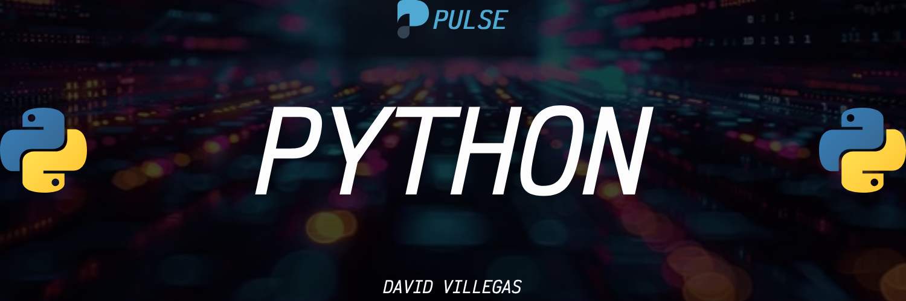

# Python



La sintaxis de Python se caracteriza por su claridad y legibilidad, lo que la convierte en un lenguaje ideal para principiantes y expertos por igual. Su diseño se basa en la idea de que el código debe ser lo más parecido posible al lenguaje natural, lo que facilita su comprensión, escritura y mantenimiento.

**Principales características de la sintaxis de Python**

- Indentación: A diferencia de otros lenguajes que utilizan llaves o palabras clave delimitar bloques de código. Python utiliza la indentación. Es decir, el nivel de sangria al inicio de una línea determina a qué bloque pertenece esa línea. Esta característica es fundamental en Python y ayuda a mantener un código limpio y organizado.

- Case Sensitive: Python distingue entre mayúsculas y minúsculas. Por ejemplo, `variable` y `Variable` son dos variables diferentes.

- Comentarios: Los comentarios se utilizan para explicar el código y se inician con el símbolo `#`. Cualquier texto después del `#` en una línea será ignorado por el intérprete de Python.

- Palabras clave: Python un conjunto de palabras reservadas que tienen un significado especial en el lenguaje, como `if`, `else`, `for`, `while`, `def`, `class`, `import`, `from`, `as`, `return`, `True`, `False`, `None`, entre otras. Estas palabras no pueden utilizarse como nombres de variables o funciones.

- Tipos de datos: Python es un lenguaje de tipado dinámico, lo que significa que no es necesario declarar el tipo de una variable antes de usarla. El intérprete lo infiera automáticamente. Los tipos de datos básicos incluyen números (enteros, flotantes), cadenas de texto (strings), booleanos (True, False) y otros más complejos como listas, diccionarios, etc.

- Operadores: Python utiliza operadores aritméticos, de comparación, lógicos y de asignación para realizar operaciones con datos.

- Estructura de control: Las estructuras de control permiten controlar el flujo de ejecución de un programa. Las más comunes son las condicionales (`if`, `else`, `elif`) y los bucles (`for`, `while`).

- Funciones: Las funciones son bloques de código reutilizable que realizan una tarea específica. Se definen con la palabra clave `def` seguida del nombre de la función y sus parámetros.

- Clases y objetos: Python es un lenguaje orientado a objetos, lo que significa que permite crear clases y objetos para modelar entidades del mundo real. Las clases son plantillas que definen las propiedades y métodos de un objeto, mientras que los objetos son instancias de una clase.

```python
# Este es un comentario

print("Hola, mundo!")  # Imprime un mensaje en la consola

# Definición de una función
def suma(a, b):
  """Suma dos números"""
  return a + b

# Llamada a la función
resultado = suma(3, 5)
print(resultado)
```

## CONTENIDO

- **[Función print()](00_print/00_print.md)**

- **[Variables](01_variables/01_variables.md)**

- **[Tipos de datos](02_tipos_datos/02_tipos_datos.md)**

- **[Operadores](03_operadores/03_operadores.md)**

- **[Cadenas de texto](04_cadenas_texto/04_cadenas_texto.md)**

- **[Listas](05_listas/05_listas.md)**
